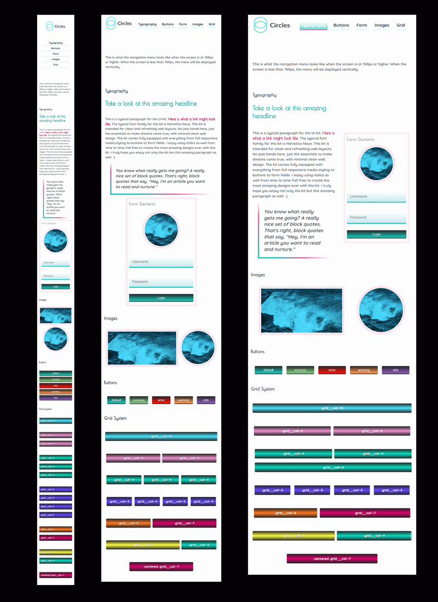

#  Team Treehouse - Web Style Guide
This is my fourth  project for the [Front End Web Development Techdegree at Treehouse](https://teamtreehouse.com/techdegree/front-end-web-development).

### Description
Creating a Style Guide that defines the look and feel of UI elements on a site.

## Table of contents
- [Overview](#overview)
  - [About this project](#about-this-project)
  - [Screenshot](#screenshot)
  - [Link](#links)
- [Process](#my-process) 
  - [Technologies used](#technologies-used) 
  - [What I learned](#what-i-learned) 
  - [Continued development](#continued-development) 
- [Author](#author) 
- [Acknowledgments](#acknowledgments) 

## Overview
  
### About this project
A *index.html* file was provided by [Treehouse](https://teamtreehouse.com/techdegree/front-end-web-development) with  a set of class names already defined. Using **Sass** to create the **Wed Style Guide** gave me my first practice of using **Sass** to create *partials, variables, extends, and mixins* to apply the styles and classes to the style guide page. Leaving me with my first **Sass micro-framework** to be able to quickly prototype other websites.

Users should be able to :
- View the UI elements of a style guide
- View the UI elements in mobile and tablet view.
- **Exceeds:** Create a *Flexbox mixin* and apply flexbox properties.
- **Exceeds:** Create a *Media Query mixin* and apply all your media queries with it.

### Screenshot of my project 4 Mobile, Tablet & Deskop layouts

## Live Link
- Live Site URL: [Project 4 - Web Style Guide](https://samatkinsonmodeste.github.io/Treehouse-Project-4-SASS/)

## My Process

### Technology Used
- Sass
- Flexbox
- Mobile-first approach

### What I learned
Once you do **Sass** there is no going back to **CSS** 😜
Using **Sass** in a project makes it much easier to find a rule for an element by using well organised partials, and how easy it is to change a variable's value, and all the changes apply across all partials.

### Continued Development
Better understanding of the different loops and the new **Sass** tools.

## Author
- Team Treehouse - [samanthaatkinson](https://www.teamtreehouse.com/samanthaatkinson)
- Twitter - [@sammodeste1](https://www.twitter.com/@sammodeste1)
- LinkedIn - [sam-atkinson-modeste](https://www.linkedin.com/<<sam-atkinson-modeste>>)
- GitHub - [SamAtkinsonModeste](https://www.github.com/SamAtkinsonModeste)

## Acknowledgments

For each project you complete and submit at **Treehouse Front End Web Development Techdegree**, an anonymous reviewer reviews your project. It is up to the reviewer how much time they spend on your project's review and whether they take the time to leave excellent comments. I wish I could thank the reviewer of my project 4 because the final comment they left undoubtedly helped build my confidence on this journey.

**See below the final comments for my project 4:**
  
  *Wow, what a great style guide you've built here! I can tell you really took the time to learn and use all the great features Sass adds to CSS. Also, you put a lot of your own personal style into the design. I love the colored blockquote, the fonts you chose to use together, and the shadows on the grid sections and buttons.*

*I hope you had fun and learned a lot in this unit and are ready to move on to unit 5 where you'll build an interactive photo gallery. Looking forward to seeing how you put your spin on that project, too! Good luck. :)*

